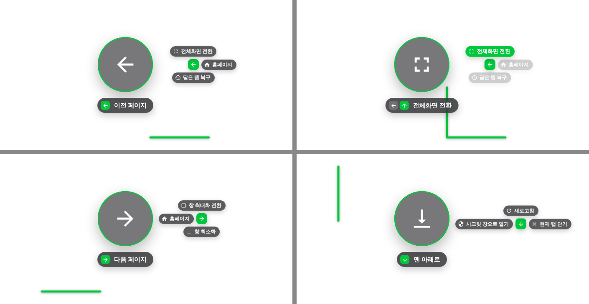

# Chrome Gesture Control

네이버 웨일 브라우저 스타일의 마우스 제스처를 크롬에서 쓰기 위한 확장 프로그램입니다.
마우스 오른쪽 버튼을 누른 채 그리면 동작합니다.

## 설치 / 업데이트
1. 이 저장소를 내려받기 (`git clone` 또는 Code → Download ZIP 후 압축 해제)
2. `chrome://extensions` 열기 → 오른쪽 위 **개발자 모드** 켜기
3. **압축해제된 확장 프로그램을 로드** → 이 폴더 선택 (이미 설치돼 있으면 카드의 ↻ 새로고침)
4. 이미 열려 있던 탭에도 자동으로 적용됩니다.

## 기본 제스처
| 제스처 | 동작 | 제스처 | 동작 |
|---|---|---|---|
| ← | 이전 페이지 | → | 다음 페이지 |
| ↑ | 맨 위로 | ↓ | 맨 아래로 |
| ← → / → ← | 홈페이지 | ↑ ↓ / ↓ ↑ | 새로고침 |
| ↑ ← | 새 창 열기 | ↑ → | 새 탭 열기 (현재 탭 옆) |
| ↓ ← | 시크릿 창으로 열기 | ↓ → | 현재 탭 닫기 |
| ← ↑ | 전체화면 전환 | ← ↓ | 닫은 탭 복구 |
| → ↑ | 창 최대화 전환 | → ↓ | 창 최소화 |

- 방향을 3번 이상 바꾸면 **취소**됩니다.
- 첫 방향을 그으면 원 오른쪽에 **이어서 갈 수 있는 방향별 동작**이 작게 표시됩니다. (예: ← 다음에 ↑ 전체화면, → 홈페이지, ↓ 닫은 탭 복구)
- **오른쪽 버튼 + 휠**: 이전/다음 탭으로 이동
- **Shift + 우클릭**: 제스처 없이 원래 우클릭 메뉴
- 모든 제스처는 설정 페이지에서 다른 동작(탭 복제, 고정, 음소거, 강력 새로고침, 이전/다음 탭 등)으로 바꿀 수 있습니다.

## 설정
툴바 아이콘 → **설정 열기** (또는 확장 카드의 "세부정보 → 확장 프로그램 옵션")
- 제스처별 동작 지정, 궤적/안내/다음 방향 미리보기 표시, 선 색상·두께, 인식 거리, 휠 탭 전환, 홈페이지 주소
- 제스처를 쓰지 않을 사이트 (툴바 팝업에서 현재 사이트를 바로 끌 수 있음)
- 전체를 끄면 툴바 아이콘에 `OFF` 배지가 표시됩니다.

## 한계
- 크롬 정책상 **새 탭 페이지, `chrome://` 페이지, 크롬 웹스토어, PDF 뷰어**에서는 동작하지 않습니다.
- **시크릿 창**: 확장 세부정보에서 "시크릿 모드에서 허용"을 켜야 합니다.
- **로컬 파일**: "파일 URL에 대한 액세스 허용"을 켜야 합니다.
- 페이지 안 **iframe**(유튜브 임베드 등) 위에서 시작한 제스처는 인식되지 않습니다.
- 우클릭 메뉴 차단 방식은 **Windows**(버튼을 뗄 때 메뉴가 뜨는 방식) 기준입니다.
- 휠 탭 전환으로 `chrome://` 같은 페이지에 도착하면, 버튼을 뗄 때 우클릭 메뉴가 뜰 수 있습니다.

## 파일 구성
| 파일 | 역할 |
|---|---|
| `manifest.json` | 확장 정의 |
| `shared.js` | 기본 설정, 동작 목록, 아이콘 (모든 곳에서 공유) |
| `gesture.js` | 페이지에서 제스처 인식 + 화면 안내 (Shadow DOM) |
| `background.js` | 탭/창 동작 실행, 기존 탭 자동 적용, 배지 |
| `options.*` / `popup.*` / `ui.css` | 설정 페이지와 툴바 팝업 |

## 라이선스
[MIT](LICENSE)
